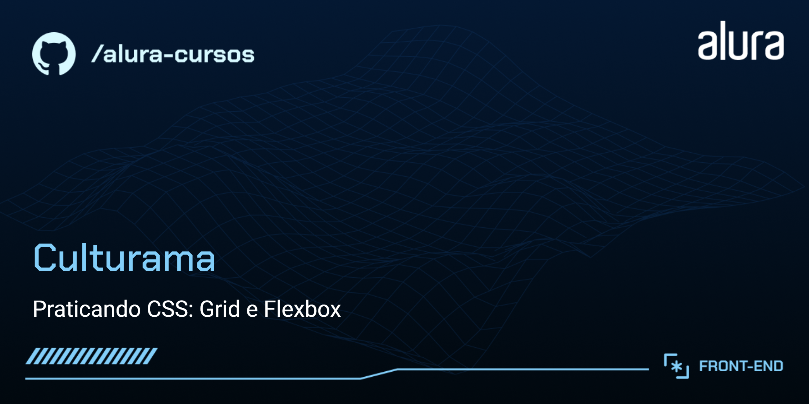

# Culturama

App de divulgação de eventos culturais.
 
Do curso da Alura "Praticando CSS: Grid e Flexbox".

## 🔨 Funcionalidades do projeto

App em HTML e CSS, sem interatividade, realizado para o estudo das propriedades CSS relacionadas ao Grid e ao Flexbox.

## ✔️ Técnicas e tecnologias utilizadas

As técnicas e tecnologias utilizadas pra isso são:

-  : construção do conteúdo da página
-  : estilização da página e responsividade
-  : fonte do projeto UI / UX
-  : controle de versão
-  : repositório do código
-  : hospedagem do site
-  : IDE

## 📁 Acesso ao projeto

Você pode acessar o resultado do projeto [aqui](https://culturama-alura-pearl.vercel.app/).
